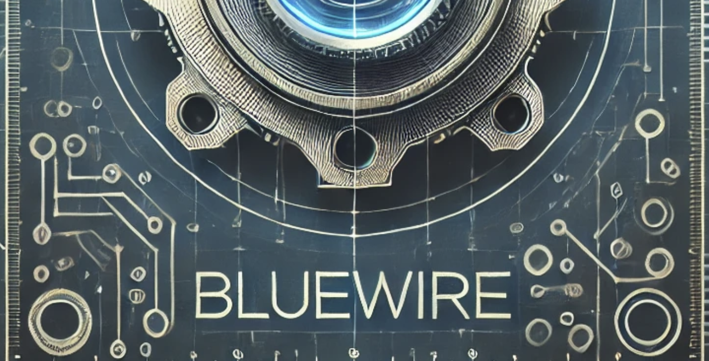
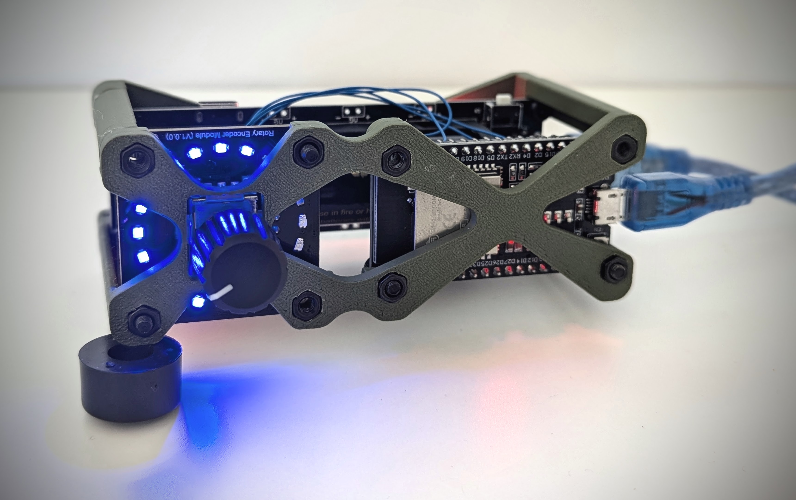
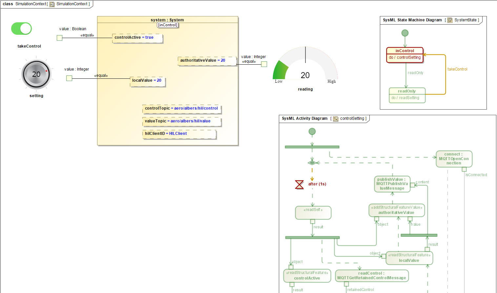

# project bluewire

## OVERVIEW

This is the project repository for a simplified demonstration of:
* Message broker
* Hardware control
* Design control
* Software control

The goal of project bluewire is to use the minimal amount of hardware, software, and modeling complexity to create a hardware-connected demonstration that a user can hold in their hands and control - watching the response from the design perspective.

## DETAILS

This repository contains a proof-of-concept, building off of what Saulius Pavalkis provided at a symposium in 2024.  Reference this [LinkedIn Post by Saulius](https://www.linkedin.com/posts/sauliuspavalkis_iot-and-hil-with-catia-magic-and-sysml-simulation-activity-7203442605337026560-9NrX/).

This implementation uses MQTT for the message broker, COTS hardware with an ESP-32 microcontroller for hardware, Cameo Systems Modeler 2024x for design software, and simple executable ruby files for software control.

The MQTT message broker has 2 active topics - one for showing whether CAMEO or REMOTE has control of the broker (the control topic) and the other for storing the value reading.

The MQTT publishers set the 'retain' flag on the messages to ensure that when clients connect, they receive the latest message published to the topic.  The ruby scripts are utilized to initialize the values on the topics.

## HARDWARE BOM
* [ESP-32 Microcontroller](https://www.amazon.com/gp/product/B0D8T53CQ5/ref=ppx_od_dt_b_asin_title_s02?ie=UTF8&psc=1)
* [Rotary Encoder Module](https://www.dfrobot.com/product-2575.html?srsltid=AfmBOooL40vc9hlK62E8fBJGLit5WPTY3ZMIfle7tOmoT5yqemdEWzI3)
* [Battery Shield](https://www.amazon.com/dp/B0CJR1Y967?ref_=ppx_hzsearch_conn_dt_b_fed_asin_title_5&th=1)
* [Battery](https://www.amazon.com/dp/B0CDRBR2M1?ref_=ppx_hzsearch_conn_dt_b_fed_asin_title_6)

TODO: add screw and hex nut sizes and link to purchase

Note: the hardware was connected solderlessly using 30 AWG wire ('blue wire') and a wire-wrapping tool.

## KIT PURCHASE

3 kit options are available for purchase if you reach out to us using the contact information at the bottom of this page.

* Option 1: unassembled kit only
* Option 2: pre-assembled kit
* Option 3: unassembled + pre-assembled kit (2 kits total) + 2 engineering consulting sessions with our team

The unassembled kit included in options 1 and 3 will include a wire wrap tool along with enough 30 AWG wire to assemble the kit.  It will have threaded inserts inset in the case material for ease of assembly.  The kits will come with the necessary connecting hardware.

## ASSEMBLY

*rev1 of the project bluewire case*

* Reference STL files in [Case Design directory](/hardware_case/)
* Purchase parts referenced in HARDWARE BOM section above
* TODO assembly
* TODO wiring

TODO: Fritzing img

## TUTORIAL

This guide will walk through options and steps for setting up a minimal example completing the objective laid out in the overview above.

### Message Broker

For initial testing, everything is configured to use the MQTT test broker, as described in the first section.  For more serious applications past testing, it is recommended to stand up a production MQTT broker.  One quick option is described in the guide below.

#### MQTT Test Broker

By default, the software/firmware code and the Cameo model are configured to use the test.mosquitto.org server.  Be aware, it is flaky and not for use in production environments.

Please see: https://test.mosquitto.org/ for more information.

#### AWS MQTT Broker

Configure and deploy an MQTT broker using a service such as AWS ECS or similar.  An example tutorial is linked below:

https://www.atom8.ai/blog/how-to-deploy-mqtt-broker-using-eclipse-mosquitto-on-amazon-ecs

### Software Control

To execute the ruby scripts, you need a version of ruby installed.  On mac or linux, use a package manager to install ruby.  On windows, it's recommended to setup wsl and install ruby on a Ubuntu VM.

From the scripts in the [Software Control directory](/control_software/), edit and run the two pubsish scripts and then the monitor script.

Replace 'company/name' in the scripts with the name of your company and project (e.g., 'acme/abc' for project abc at company acme).

Execute the scripts directly (after installing the 'mqtt' gem)
```console
$ gem install mqtt
$ ruby retainControlPublish.rb
$ ruby retainValuePublish.rb
$ ruby monitor.rb
```

### Design Control
* Ensure the 'Web Server for Cameo Simulation Toolkit' plugin is installed (restart Cameo after installation)
* Load the mdzip file contained in the [Design Control directory](/control_design/)

* Ensure the Default Values of the control topic and value topic properties on the system are set correctly for your company/project name.
* Launch the simulation configuration

### Hardware Control

Flash firmware from the ESP-32 project located in the [Hardware Control directory](/control_hardware/) directory via the PlatformIO VS code plugin linked below.

[Visual Studio Code - PlatformIO ESP-32](https://docs.platformio.org/en/latest/platforms/espressif32.html)

## DEMO

If you would like a demonstration of the interaction between design, hardware, and software, see the contact section below and we'll find a time that to connect.

## CONTACT

Please reach out if we can be of assistance in helping you accelerate digital engineering adoption.

defense [at] albers.aero