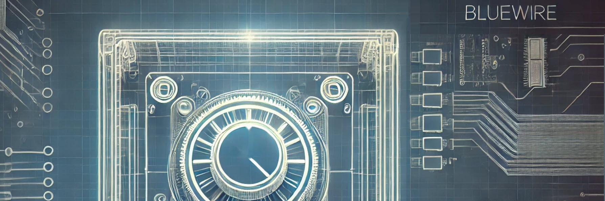

# Design Control

* Ensure the 'Web Server for Cameo Simulation Toolkit' plugin is installed (restart Cameo after installation)
* Load the mdzip file contained in this [Design Control directory](/control_design/)

* Ensure the Default Values of the control topic and value topic properties on the system are set correctly for your company/project name.
* Launch the simulation configuration