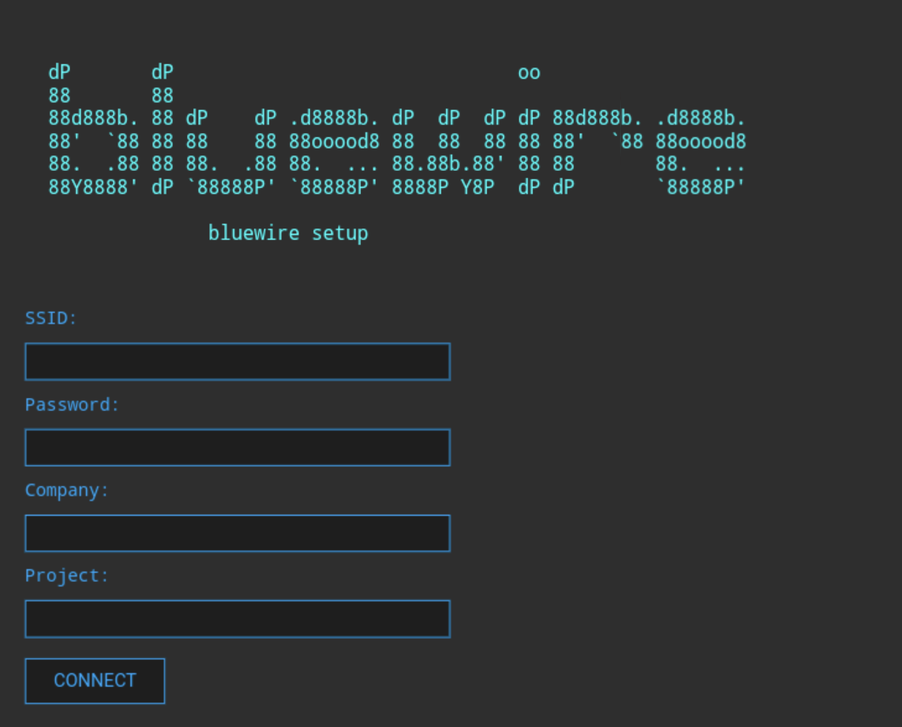

# HARDWARE CONTROL

Flash firmware from the ESP-32 project located in the [Hardware Control bluewire_esp32 sub-directory](/control_hardware/bluewire_esp32/) via the PlatformIO VS code plugin linked below.

[Visual Studio Code - PlatformIO ESP-32](https://docs.platformio.org/en/latest/platforms/espressif32.html)

When you power on the device initially, it will come up in a 'soft AP' wifi mode.

If you connect to the 'bluewire_setup' ssid, use password 'bluewire1234', then open a web browser and navigate to http://192.168.4.1 you will be presented with a screen to enter your ssid/pass for an internet connected wifi of your choice.

You should enter a company and project name - this will be used in the topics

Once connected, your mqtt messages will be published to the control and value topics using the company and project names you entered.

To reset credentials and go back to the 'soft AP' mode, press and release the button quickly for at least 5 seconds.